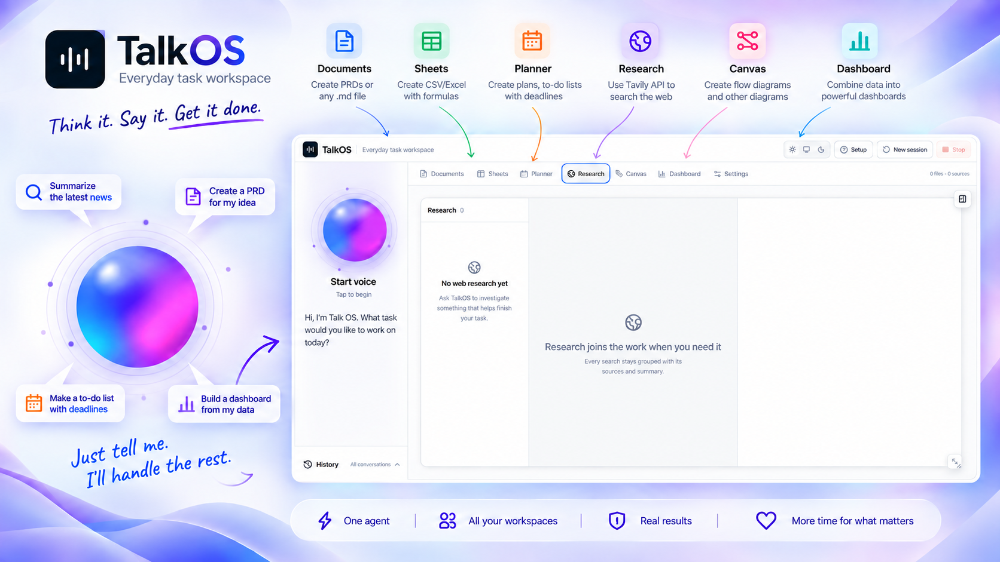
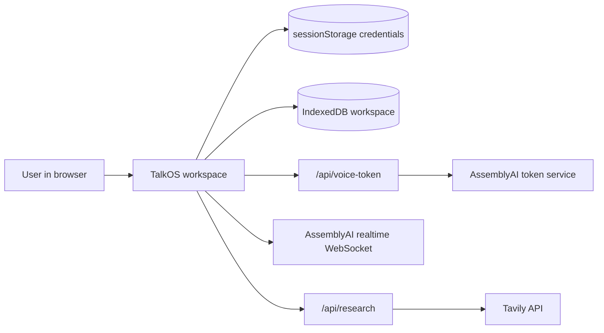

# TalkOS

[](https://github.com/sahil-sharma-50/Talk-OS/actions/workflows/ci.yml)
[](https://talk-os-app.vercel.app/)

TalkOS is a voice-directed productivity workspace. Speak an outcome and the agent can coordinate documents, working spreadsheets, plans, source-backed research, visual canvases, and live dashboards in one browser workspace.

The interaction is built for correction while work is happening. If a user interrupts with a new constraint, TalkOS cancels active work, rejects stale results, revises the task, and records the coordinated change as an undoable activity.



## How it works



The browser owns the workspace state and editors. `app/api/voice-token` exchanges an AssemblyAI key for a short-lived session token; the browser then opens the realtime WebSocket directly. `app/api/research` proxies constrained Tavily search and extraction requests. Neither route stores credentials or workspace data. See [Architecture](docs/ARCHITECTURE.md) for the module map and data flow.

## Highlights

- Realtime voice sessions powered by AssemblyAI, with live captions, interruption, mute, and recovery controls.
- Documents with Markdown editing, TXT/Markdown/text-PDF import, section-aware composition, embedded canvas and sheet snapshots, and portable Markdown export.
- Sheets with CSV/XLSX import, CSV export, formatting, formulas, charts, row operations, and ranges up to `A1:Z1000`.
- Planners with task details, ordering, dates, conflict detection, CSV export, and calendar ICS export.
- Canvases with freehand drawing, shapes, connectors, images, automatic layout, and SVG/PNG/JSON export.
- Dashboards composed from selected workspace sources, with live metrics, charts, deadlines, summaries, and movable layouts.
- Tavily-backed research organized by query with inspectable sources and extracted content.
- Local-first workspace persistence, revision checks, visible activity receipts, and undo/redo for agent changes.

## Technology

| Area | Technology |
| --- | --- |
| Application | Next.js 16 App Router, React 19, and TypeScript |
| Voice | AssemblyAI realtime voice agents |
| Research | Tavily search and content extraction |
| Storage | IndexedDB and browser session storage |
| Quality | Vitest, Testing Library, TypeScript, and ESLint |
| Delivery | Vercel and GitHub Actions CI |

## Requirements

| Requirement | Details |
| --- | --- |
| Node.js | Version 24.x |
| npm | Version 11 or a compatible version supplied with Node.js 24 |
| Browser | A modern browser with microphone support |
| AssemblyAI | An API key and published Agent ID for voice features |
| Tavily | An optional API key for live research |

## Run locally

Clone the repository:

```bash
git clone https://github.com/sahil-sharma-50/Talk-OS.git
cd Talk-OS
```

Copy the example environment file before running the project. On Windows PowerShell:

```powershell
Copy-Item .env.example .env.local
```

On macOS or Linux:

```bash
cp .env.example .env.local
```

Then install the exact dependency versions and start the development server:

```bash
npm ci
npm run dev
```

Open [http://localhost:3000](http://localhost:3000). TalkOS can start with the empty example values. Open **Settings** in the app and provide your AssemblyAI API key, AssemblyAI Agent ID, and optional Tavily API key. You may instead place those credentials in `.env.local` for local development. Never commit `.env.local` or any populated environment file.

## Available commands

| Command | Purpose |
| --- | --- |
| `npm run dev` | Start the development server |
| `npm run build` | Create a production build |
| `npm start` | Serve the production build |
| `npm run lint` | Run ESLint with zero warnings allowed |
| `npm run typecheck` | Check TypeScript without emitting files |
| `npm test` | Run Vitest in watch mode |
| `npm run test:run` | Run the complete test suite once |
| `npm run check` | Run lint, types, tests, and the production build |

## Privacy and security

- Workspace artifacts, conversation history, research, trash, and activity receipts persist locally in IndexedDB.
- Saved API credentials use tab-scoped `sessionStorage`; TalkOS excludes them from IndexedDB and workspace exports.
- Voice content and requested workspace context are sent to AssemblyAI during an active session.
- Research queries and selected URLs are sent to Tavily.
- The application does not include a cloud database or cross-device synchronization.
- Production ignores server-side API keys unless `TALKOS_ALLOW_SERVER_CREDENTIALS=true` is explicitly enabled.

Read [Security](SECURITY.md) before enabling server-funded credentials.

## Contributing and license

Contributions should pass `npm run check` before a pull request is opened. See [CONTRIBUTING.md](CONTRIBUTING.md) for the development workflow.

TalkOS is available under the [MIT License](LICENSE).
