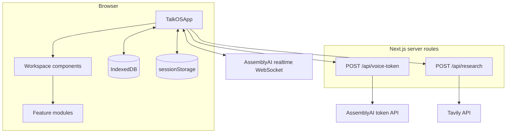

# TalkOS Architecture

TalkOS is a client-centered Next.js application. The browser owns the product state and most application logic; two small server routes protect upstream API calls and avoid exposing long-lived provider credentials in URLs.

## Runtime boundaries

### Browser

`components/talkos/TalkOSApp.tsx` is the composition root. It connects the voice session state, workspace state, persistence, navigation, credentials, and UI surfaces.

The browser stores:

- workspace artifacts and history in IndexedDB under the `talkos` database;
- API credentials in tab-scoped `sessionStorage` under `talkos.credentials`;
- the visual theme preference in `localStorage`.

Credentials are separate from workspace snapshots and exports.

### Server routes

`POST /api/voice-token` validates same-origin requests, credential shape, and an allowlisted `us` or `eu` region, then exchanges the AssemblyAI API key for a single-use token with a 120-second expiry and a 10-minute session limit. European browser time zones default to AssemblyAI's EU token and realtime WebSocket hosts; other time zones default to the US hosts. This is a latency-routing heuristic, not a general data-residency guarantee: application hosting and Tavily research traffic are configured separately.

`POST /api/research` validates same-origin JSON requests and proxies two constrained Tavily actions: search and extraction. Search returns at most five results; extraction accepts at most eight HTTP or HTTPS URLs.

In production, both routes require credentials in the request unless `TALKOS_ALLOW_SERVER_CREDENTIALS=true` explicitly enables server-side fallback credentials.

## Source layout

| Path | Responsibility |
| --- | --- |
| `app/` | Next.js layout, page, global styles, metadata, and API routes |
| `components/talkos/` | Interactive React workspace surfaces and controls |
| `features/session/` | Conversation, voice, activity, and session state transitions |
| `features/workspace/` | Workspace data model, persistence, imports, exports, formulas, and revisions |
| `features/voice/` | AssemblyAI adapter, prompts, tools, interruption, and tool execution |
| `features/canvas/` | Canvas geometry, scene operations, layout, rendering, and export |
| `features/dashboard/` | Dashboard bindings, layout, selectors, suggestions, and export |
| `features/demo/` | Deterministic showcase fixtures and controller |
| `public/` | Static browser assets, including the PCM audio worklet |

Detailed ownership notes live in the README inside each major source boundary.

## State and change flow

1. `TalkOSApp` loads a versioned `WorkspaceSnapshot` from IndexedDB or creates a default workspace.
2. Direct user edits update the workspace model and queue a local save.
3. Voice events flow through the session reducer and update captions, connection state, and activity.
4. Voice tools read the current workspace through `WorkspaceRuntime` and return revision-checked mutations.
5. Coordinated mutations are applied together and recorded in `changeHistory` so the activity can be undone or redone.
6. Sustained local microphone activity pauses the output audio clock and captions while an independent microphone clock keeps streaming. Server speech confirmation aborts active work and clears old playback; unconfirmed noise resumes the same output position after a quiet interval.

## Voice workflow reliability

Tool completion and result delivery are separate events. Results drain after the newest server reply completes and stay deliverable until the server starts another reply or the user speaks. Sending one result does not close this boundary: the server may need all parallel results before replying. Older completion events cannot reopen it. Opaque reply IDs can acknowledge a batch of tool results, so continuation ownership consumes the batch rather than reserving one future reply per tool.

Research deadlines are ordered: Tavily proxy 20 seconds, browser request including response decoding 30 seconds, provider research tool 60 seconds. The previous equal 20-second provider/proxy limits could expire a call before successful evidence reached the voice agent, causing an apology alongside visible results. A hung browser request aborts and cannot commit later. Failed extraction returns saved snippets for continued work. Tool results carry the complete request and current time. New researched documents retain their generated content and gain a labeled reference appendix for sources actually returned to that request if their URLs are missing. Missing citations are not a fatal tool error: live testing showed the provider apologized instead of repairing a rejected complete draft. The appendix lists retrieved references, not independently verified claim-level citations; unrelated workspace history is excluded and explicit document edits are not rewritten. Research summaries may combine valid sources across collections without dropping the target collection's existing sources; unknown IDs and empty summaries are rejected before mutation.

Agent caption words follow the output clock. Untimed agent deltas are masked until a final transcript can be paced over buffered PCM (estimated timing). User partials are different: continuous partial updates are requested explicitly and rendered immediately, never paced against assistant audio or delayed until end-of-turn. An anonymous partial adopts the provider's eventual item ID, avoiding repeated text when the final arrives. Expensive workspace panels are memoized so microphone energy, telemetry and transcript ticks do not re-render the open editor. Audible responses mark conversation boundaries; early network words do not split a continued user request. A 45-second reply stall exposes a reconnect error while preserving saved artifacts, instead of silently discarding the response and leaving the user guessing.

Developer telemetry records session identifiers, local completion and result delivery separately. No API credentials are included.

The September 2026 AssemblyAI skill audit was checked against the live [event reference](https://www.assemblyai.com/docs/voice-agents/voice-agent-api/events-reference) and [session configuration](https://www.assemblyai.com/docs/voice-agents/voice-agent-api/session-configuration). Tool envelopes explicitly set `is_error` from the execution outcome; successful searches are not errors, while failures retain saved-source recovery context. Use `balanced` transcription with zero added interruption delay: the [turn-taking documentation](https://www.assemblyai.com/docs/voice-agents/voice-agent-api/turn-detection-and-interruptions) identifies `min_latency` as least patient during pauses. Leave explicit silence thresholds unset to retain adaptive and semantic endpointing. The STT prompt describes domain vocabulary; behavioral instructions belong in the system prompt. Keep interactive tools for this interruptible workspace; hold mode delays user transcripts. This is the Voice Agent API, not standalone Streaming v3, so its field names and 24 kHz PCM format must be retained.

## Workspace model

The versioned model in `features/workspace/workspace.types.ts` contains documents, sheets, planners, canvases, dashboards, research collections, trash, conversation turns, and the active task. `workspace-storage.ts` owns serialization, validation, migrations, and IndexedDB access.

Document and sheet embeds store snapshots. Updating the source artifact does not silently rewrite an embedded snapshot; the user or agent must request a refresh. This keeps exported documents stable and auditable.

## Testing strategy

Vitest and Testing Library cover reducers, model operations, imports and exports, formula evaluation, API route policies, voice tools, interruption behavior, UI interaction, and accessibility-sensitive layout behavior. The GitHub Actions workflow runs linting, type checking, all tests, and a production build for every pull request and push to `main`.

For opt-in provider integration checks with a local dev server and configured credentials, run `node scripts/probe-workflow.mjs`. It uses the production adapter and real research service with an empty in-memory workspace, leaving browser artifacts untouched. `--delay-research` injects a 22-second response delay; `--speech` generates and streams a spoken request through the microphone path. The normal workflow requires a created document with source links to pass. `--fail-research` instead simulates an HTTP failure and verifies that an error-tagged result produces a provider reply without a protocol error. The probe does not verify physical speaker/microphone acoustics. These checks incur normal provider usage and do not run in CI.
