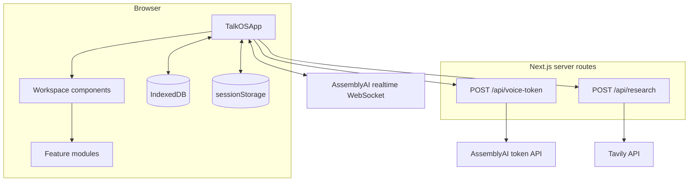

# TalkOS Architecture

TalkOS is a client-centered Next.js application. The browser owns the product state and most application logic; two small server routes protect upstream API calls and avoid exposing long-lived provider credentials in URLs.

## Runtime boundaries

### Browser

`components/talkos/TalkOSApp.tsx` is the composition root. It connects the voice session state, workspace state, persistence, navigation, credentials, and UI surfaces.

The browser stores:

- workspace artifacts and history in IndexedDB under the `talkos` database;
- API credentials in tab-scoped `sessionStorage` under `talkos.credentials`;
- the visual theme preference in `localStorage`.

Credentials are separate from workspace snapshots and exports.

### Server routes

`POST /api/voice-token` validates same-origin requests and credential shape, then exchanges the AssemblyAI API key for a single-use token with a 120-second expiry and a 10-minute session limit. The browser uses that token to connect directly to AssemblyAI's realtime WebSocket.

`POST /api/research` validates same-origin JSON requests and proxies two constrained Tavily actions: search and extraction. Search returns at most five results; extraction accepts at most eight HTTP or HTTPS URLs.

In production, both routes require credentials in the request unless `TALKOS_ALLOW_SERVER_CREDENTIALS=true` explicitly enables server-side fallback credentials.

## Source layout

| Path | Responsibility |
| --- | --- |
| `app/` | Next.js layout, page, global styles, metadata, and API routes |
| `components/talkos/` | Interactive React workspace surfaces and controls |
| `features/session/` | Conversation, voice, activity, and session state transitions |
| `features/workspace/` | Workspace data model, persistence, imports, exports, formulas, and revisions |
| `features/voice/` | AssemblyAI adapter, prompts, tools, interruption, and tool execution |
| `features/canvas/` | Canvas geometry, scene operations, layout, rendering, and export |
| `features/dashboard/` | Dashboard bindings, layout, selectors, suggestions, and export |
| `features/demo/` | Deterministic showcase fixtures and controller |
| `public/` | Static browser assets, including the PCM audio worklet |

Detailed ownership notes live in the README inside each major source boundary.

## State and change flow

1. `TalkOSApp` loads a versioned `WorkspaceSnapshot` from IndexedDB or creates a default workspace.
2. Direct user edits update the workspace model and queue a local save.
3. Voice events flow through the session reducer and update captions, connection state, and activity.
4. Voice tools read the current workspace through `WorkspaceRuntime` and return revision-checked mutations.
5. Coordinated mutations are applied together and recorded in `changeHistory` so the activity can be undone or redone.
6. If the user interrupts, active network and tool work is aborted; late results are rejected before they can change the workspace.

## Workspace model

The versioned model in `features/workspace/workspace.types.ts` contains documents, sheets, planners, canvases, dashboards, research collections, trash, conversation turns, and the active task. `workspace-storage.ts` owns serialization, validation, migrations, and IndexedDB access.

Document and sheet embeds store snapshots. Updating the source artifact does not silently rewrite an embedded snapshot; the user or agent must request a refresh. This keeps exported documents stable and auditable.

## Testing strategy

Vitest and Testing Library cover reducers, model operations, imports and exports, formula evaluation, API route policies, voice tools, interruption behavior, UI interaction, and accessibility-sensitive layout behavior. The GitHub Actions workflow runs linting, type checking, all tests, and a production build for every pull request and push to `main`.
